<div align="center">
<h1><a href="docs/INSTALLATION.md">Installation Guide</a></h1>
</div>

<div align="center">
<h1><a href="UPDATES.md">Update Log</a></h1>
</div>

<div align="center">

</div>

<div align="center">
<h1>Kabus Marketplace Script</h1>
</div>

### Supporting Development
The Kabus marketplace script is now maintained by The Erebus Development Team. The creation of the original Kabus Marketplace Script is credit to Sukunetsiz. To support the continued deveopment of this script by The Erebus Development Team please consider donating to one of the payment addresses below:

**CashApp (USD)**
```
$AnonymousUser9183
```
**Monero (XMR)**
```
45umQEDfN52gzHMpUxkK8TUAeZjFgzb2VDmZArgx4iTHeGY4gb2KrtqZC691Ff9pHaJeUFF1oBZAGQHTHzps7icg5cdptMG
```
**Bitcoin (BTC)**
```
bc1qwnpu53a233u864z5tc66v4454tlamg3ljvcxa0
```
**Litecoin (LTC)**
```
ltc1qm0n4fqdhc6nz6ed9vafjqdx86a4pqj3t5ed7mc
```

*All donations are used exclusively for maintaining and improving The Erebus Marketplace Script's open source codebase and Kabus Marketplace Script.*
---

## Introduction

My name is AnonymousUser9183, lead developer of The Erebus Marketplace Script, the successor of Kabus Marketplace Script. This repository contains the Kabus Marketplace Script developed by Sukunetsiz. I will be maintaining and upgrading this script in support of the community.

It is recommended to use Erebus Marketplace Script instead of Kabus Marketplace Script because Erebus has major security improvements, updated framework a fully rewritten design and the addition of various new features.

The purpose of hosting the original Kabus Marketplace Script is to contribute to the Monero ecosystem and ensure its growth. Like Erebus Marketplace Script, Kabus Marketplace Script is not permitted to be used for any form of illegal purposes.

Kabus Marketplace Script was created by the developer Sukunetsiz and was built on PHP 8.3 and Laravel 11.

## Core Features

### Monero Integration
- **Vendor Registration Payment**: Monero Wallet RPC integration that generates a wallet address for vendor fee payments, with support for separate transactions and a 24-hour payment window
- **Product Advertising Payment**: Integrated payment system for vendors to advertise their products on the homepage through Monero transactions
- **Product Purchasing**: Integrated Monero payment system for secure and anonymous product transactions
- **Return Address System**: Validation for user's Monero return addresses

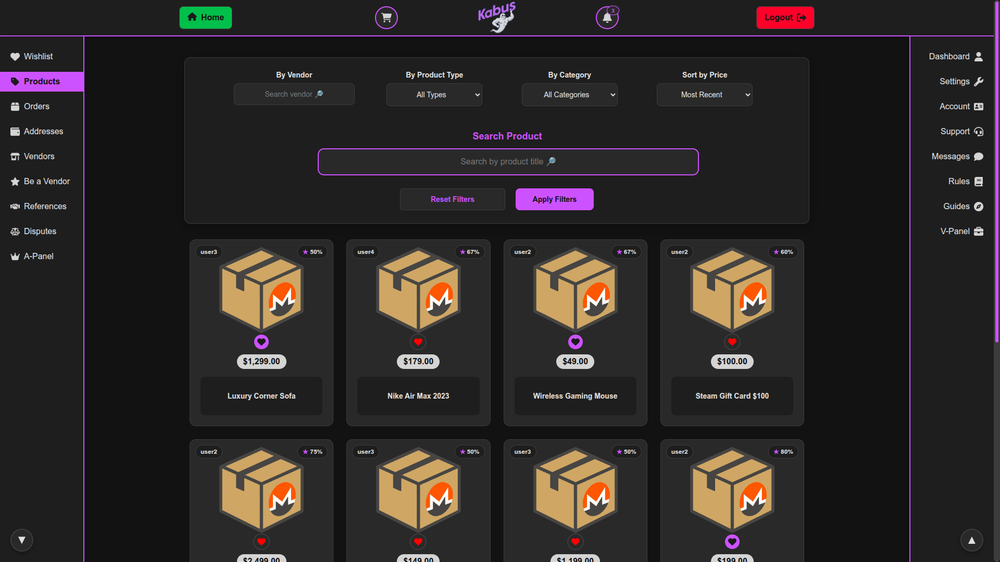

### Marketplace Functions
- **User Dashboard**: Comprehensive control panel for account management
- **Vendor Profiles**: Vendor pages with product listings
- **Product Management**: Search functionality and wishlist feature
- **Messaging System**: Secure communication between users
- **Admin Panel**: Complete administrative control interface
- **Vendor Panel**: Dedicated interface for vendor operations
- **Reference System**: Optional referral code requirement for registration
- **Educational Resources**: Comprehensive guides on Monero, Tor, KeePassXC and Kleopatra usage for new users
- **Support System**: Integrated help desk functionality
- **Disputes System**: Facilitates resolution of order-related issues between buyers and vendors with administrative intervention when necessary

### Security & Privacy
- **Walletless Escrow System**: No user wallets; payments are made per order and escrowed until order resolution
- **PGP Integration**: Mandatory PGP key confirmation for vendors to verify key ownership
- **Two-Factor Authentication**: Enhanced security through PGP-based 2FA
- **Mnemonic Recovery**: Built-in mnemonic phrase generation for key recovery
- **No JavaScript**: Built entirely with pure PHP and does not utilize JavaScript in any capacity

### Other Screenshots

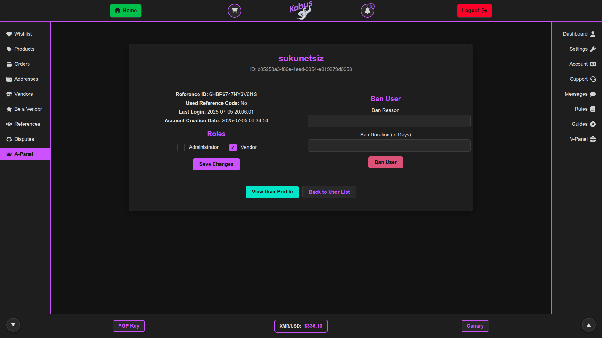
---
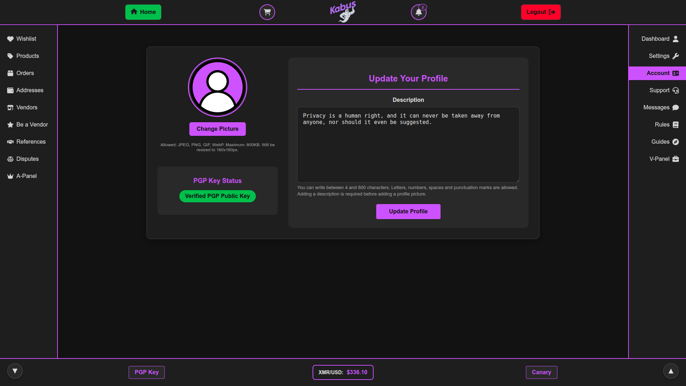
---
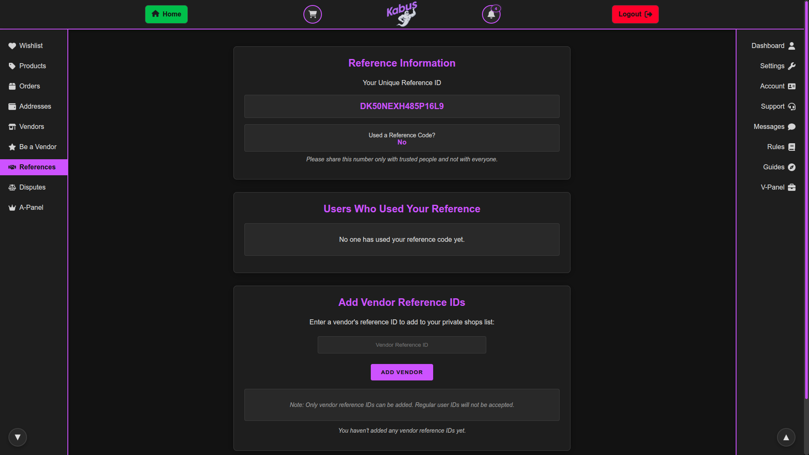
---
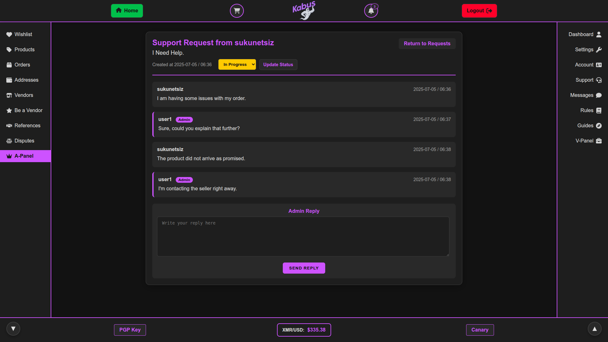
---
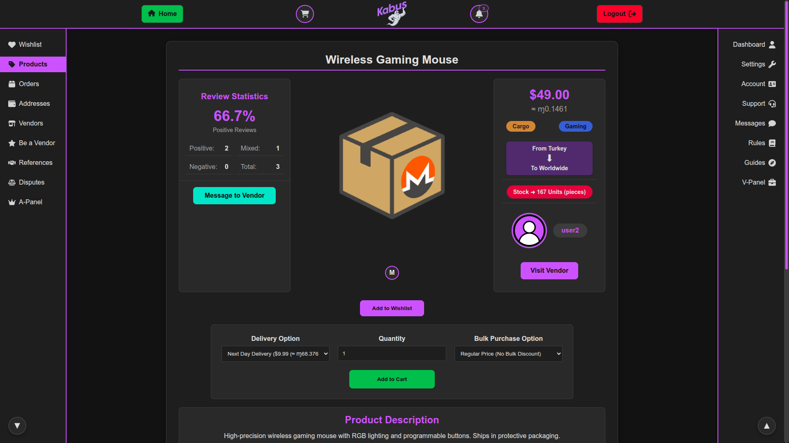
---
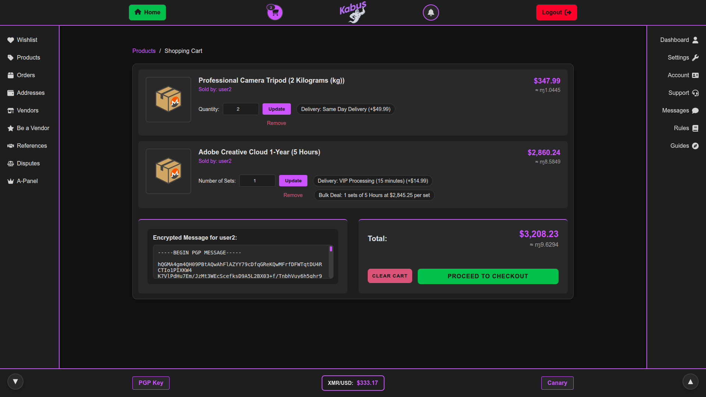
---
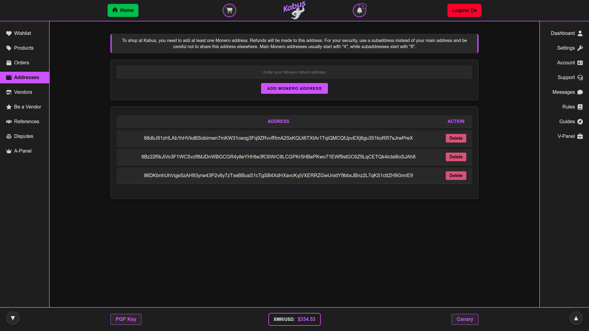
---
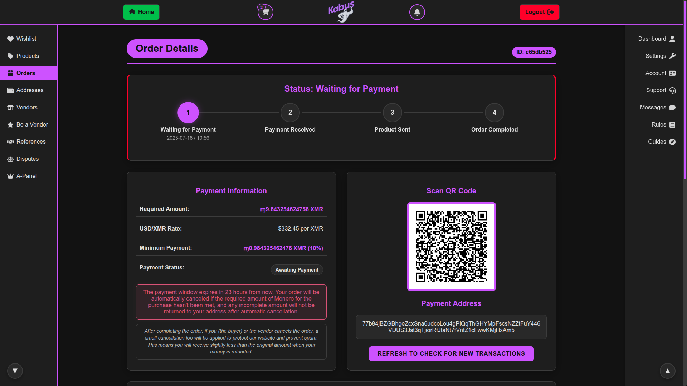
---
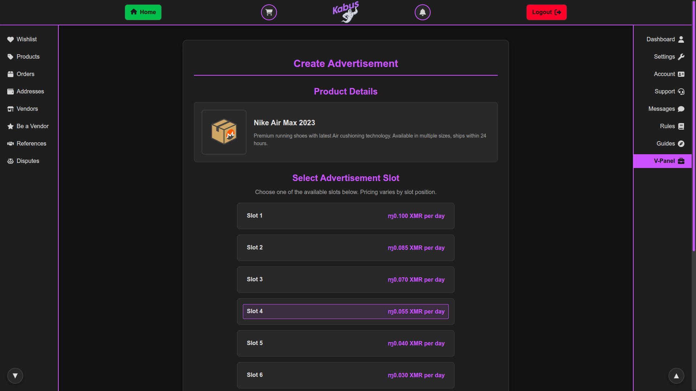
---
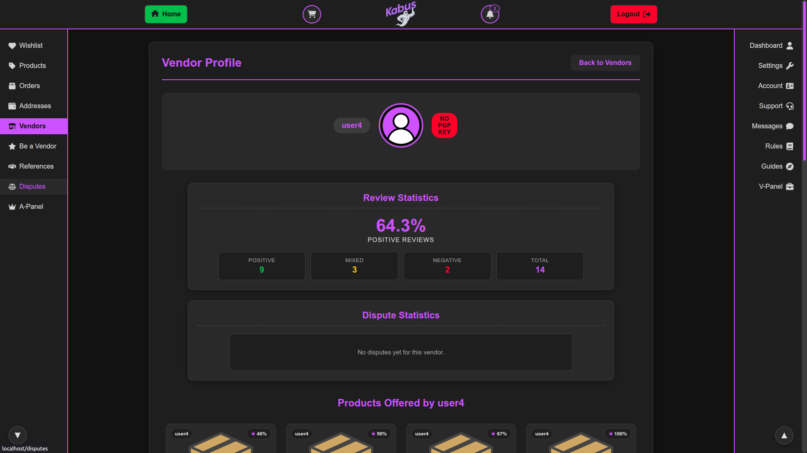
---
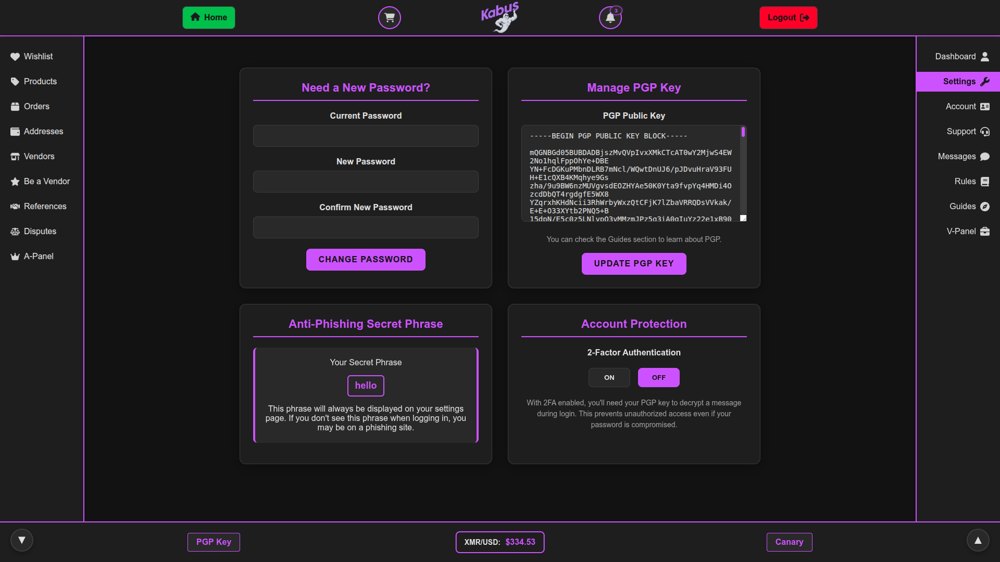
---
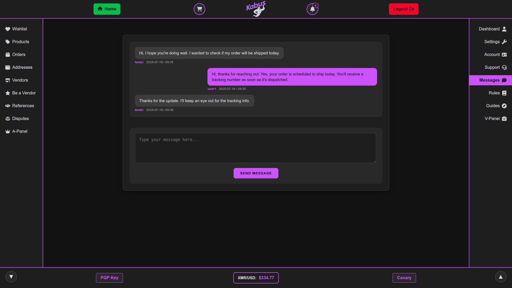
---
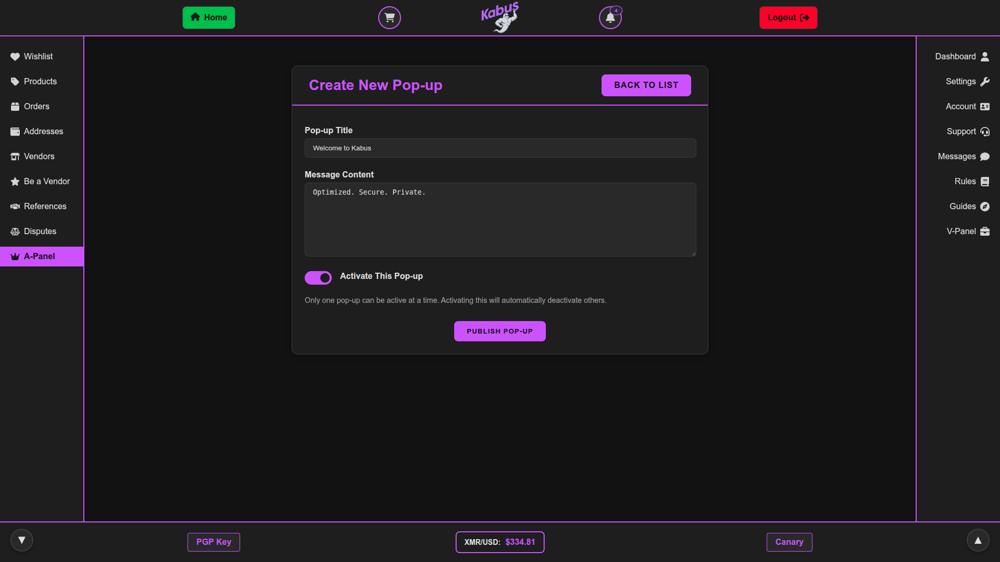
---
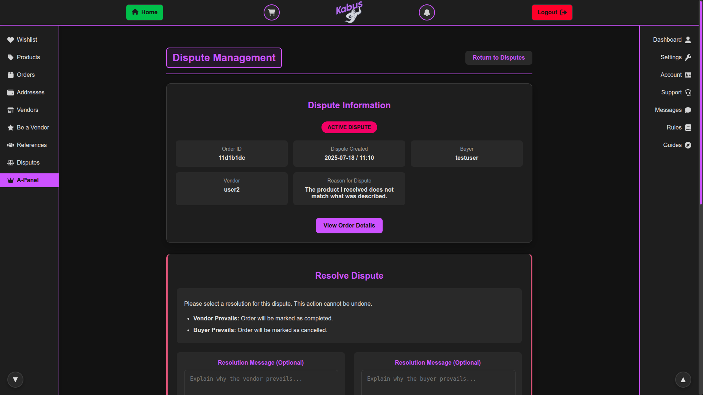
---
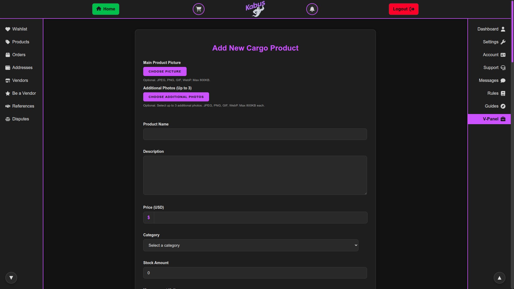
---
<div align="center">
<h1><a href="docs/ROADMAP.md">View the Roadmap</a></h1>
</div>

<div align="center">
<h1><a href="docs/CONNECTING-MONERO-RPC.md">Monero Wallet RPC Guide</a></h1>
</div>


```
Privacy is a human right. It cannot be taken away from anyone, 
nor should its protection ever be suggested as controversial.
```

The creation of the original Kabus Marketplace Script is credited to Sukunetsiz.
